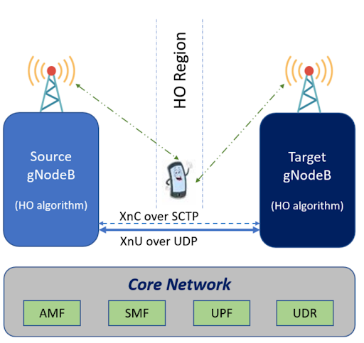
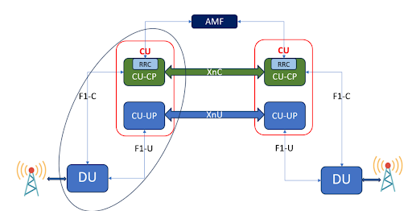
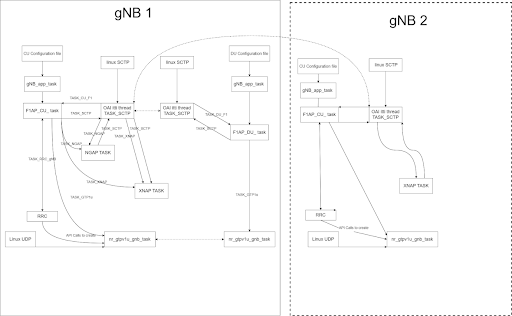
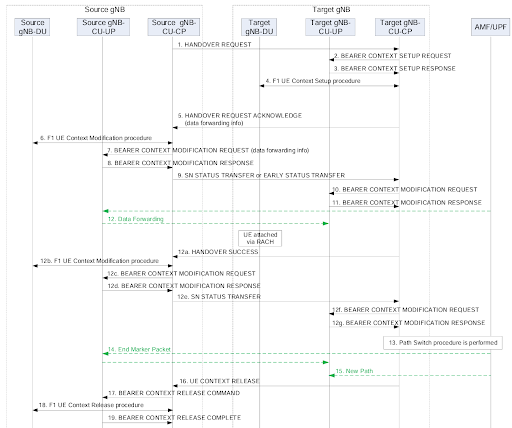

**INTER-CU-MOBILITY: XN Handover**

3GPP References: 38.401 Section 8.9.4, 38.423,38,422, 38.424, 38.473, 38.463

**HIGH LEVEL OVERVIEW**

1.  Implementation of XnAP Framework
2.  HO Decision at source gNB
3.  Resource check and HO decision at Target gNB
4.  UE moving from source to target (Change in Uplink)
5.  PDU Session Management (Change in Downlink)
6.  UE Release from Source gNB

**ARCHITECTURE**

**WORK DONE**

1.  Before IOS-MCN

<!-- end list -->

  - XNAP ASN Library creation in OAI during build.

  - Design, Implementation and Testing -XNAP Setup Req/Resp in monolithic gNB

**CALL FLOW**

{width=1200}

1.  (1) The source gNB-CU-CP sends a HANDOVER REQUEST message to the
    target gNB-CU-CP.
    
    1.  IEs in HO REQUEST Reference: 38.423 section 9.1.1.1.
    
    2.  UE IDs: Source NG-RAN node UE XnAP ID reference
    
    3.  Target ID: CGI
    
    4.  AMF ID: GUAMI
    
    5.  UE Context Information: AMF UE NGAP ID, AMF IP-NG C, Security Capabilities, AMBR, PDU Session to setup, RRC Context (HO Prep Info).

2.  (2-4) Bearer Context Setup procedure.
    
    1.  The gNB-CU-CP sends a BEARER CONTEXT SETUP REQUEST message containing UL TNL address information for NG-U, and if required, DL TNL address information for Xn-U to setup the bearer context in the gNB-CU-UP. For NG-RAN, the gNB-CU-CP decides flow-to-DRB mapping and sends the generated SDAP and PDCP configuration to the gNB-CU-UP.
    
    2.  The gNB-CU-UP responds with a BEARER CONTEXT SETUP RESPONSE message containing the UL TNL address information for F1-U, and DL TNL address information for S1-U or NG-U, and if required, UL TNL address information for X2-U or Xn-U.
    
    3.  F1 UE context setup procedure is performed to set up one or
    more bearers in the gNB-DU (HO Prep Info can be sent in rrc container).
    
    4.  The gNB-CU-CP sends a BEARER CONTEXT MODIFICATION REQUEST
    message containing the DL TNL address information for F1-U and PDCP status.
    
    5. The gNB-CU-UP responds with a BEARER CONTEXT MODIFICATION RESPONSE message.

3.  (5) The target gNB-CU-CP responds to the source gNB-CU-CP with an HANDOVER REQUEST ACKNOWLEDGE message.

4.  (6) The F1 UE Context Modification procedure is performed to send the handover command to the UE, and to indicate to stop the data transmission for the UE.

5.  (7-8) Bearer Context Modification procedure (gNB-CU-CP initiated) is performed to enable the gNB-CU-CP to retrieve the PDCP UL/DL status and to exchange data forwarding information for the bearer.

6.  (9) The source gNB-CU-CP sends an SN STATUS TRANSFER message to the target gNB-CU-CP.

7.  (10-11) Bearer Context Modification procedure is performed as
described in Section 8.9.2. The COUNT related info carried by the
EARLY STATUS TRANSFER message is also provided to the target
gNB-CU-UP. 

8.   (12)  Data Forwarding may be performed from the source gNB-CU-UP to the target gNB-CU-UP.

9.   (13-15) Path Switch procedure is performed to update the DL TNL address information for the NG-U towards the core network.

10. The target gNB-CU-CP sends an UE CONTEXT RELEASE message to the source gNB-CU-CP. 

11. (17-19) Bearer Context Release procedure is performed.  F1 UE Context Release procedure is performed to release the UE context in the source gNB-DU.

**Initiating Message: PATH SWITCH REQUEST (Target gNB -\> AMF)**

The purpose of the Path Switch Request procedure is to establish a UE associated signalling connection to the 5GC and, if applicable, to request the switch of the downlink termination point of the NG-U transport bearer towards a new termination point.

The NG-RAN node initiates the procedure by sending the PATH SWITCH REQUEST message to the AMF, to inform the AMF of the new serving NG-RAN node and to transfer some NG-U DL **tunnel** termination point(s) to the SMF via the AMF for one or multiple PDU session resources.

Fig: Path Switch Request procedure, Successful operation

RRC Reconfiguration Complete from UE to Target gNB triggers Path Switch Request to AMF. Upon reception of the PATH SWITCH REQUEST message the AMF shall, for each PDU session indicated in the PDU Session ID IE, transparently transfer the ***Path Switch Request Transfer*** IE to the SMF associated with the concerned PDU session.

After all necessary updates including the user plane path switch have been successfully completed in the 5GC for at least one of the PDU session resources included in the PATH SWITCH REQUEST, the AMF shall send the PATH SWITCH REQUEST ACKNOWLEDGE message to the NG-RAN node and the procedure ends.

IEs include:

PATH SWITCH REQUEST:

  - Message type.

  - RAN-UE-NGAP-ID (0-2^40 -1)

  - SourceAMF-UE-NGAP-ID (0-2^40-1)

  - UserLocationInformation

This IE is used to provide location information of the UE.

  - UESecurityCapabilities: The target NG-RAN receives UE security Capabilities from HANDOVER REQUEST message, stores the received UE Security Capabilities in the UE context.

  - PDUSessionResourceToBeSwitchedDLList (OCTET STRING)

<!-- end list -->

  - PathSwitchRequestTransfer includes.
    
    1.  DL NG-U UP TNL Information: For each PDU session for which the Additional DL QoS Flow per TNL Information IE is included in the Path Switch Request Transfer IE of the PATH SW REQUEST message, the SMF may use each included UP transport layer information as the downlink termination point for included associated QoS flows for this PDU session split in different tunnels.
    
    2.  QoS Flow Accepted Item-\> (QoS Flow Identifier): The list of accepted QoS flows shall be included in the PATH SWITCH REQUEST message within the Path Switch Request Transfer IE. The SMF shall handle this information.

**Successful Outcome: PATH SWITCH REQUEST ACKNOWLEDGE (Target gNB \<- AMF)**

The AMF sends this message to inform the NG-RAN node that the path
switch has been successfully completed in the 5GC. Direction: AMF → NG-RAN node.

IEs include:

PATH SWITCH REQUEST ACKNOWLEDGE:

  - Message Type

  - AMF-UE-NGAP-ID: NGAP ID of AMF, in path switch request acknowledged. It should match with gnb context

  - RAN-UE-NGAP-ID: NGAP ID of RAN, it should match with gnb context

  - SecuriyContext
 Upon reception of the PATH SWITCH REQUEST ACKNOWLEDGE message the NG-RAN node shall store the received Security Context IE in the UE context.

  - PDUSessionResourceSwitchedList (OCTET STRING)
 PathSwitchRequestAcknowledgeTransfer If the Security Indication IE is included within the Path Switch Request Acknowledge Transfer IE of the PATH SWITCH REQUEST ACKNOWLEDGE message, If the UL NG-U UP TNL Information IE is included within the Path Switch Request Acknowledge Transfer IE of the PATH SWITCH REQUEST ACKNOWLEDGE message, the NG-RAN node shall store this information and use it as the uplink termination point for the user plane data for this PDU session.

  - AllowedNSSAI This IE contains the allowed NSSAI. maxnoofAllowedS-NSSAIs (Value is 8)

  - UE Security Capabilities: If the UE Security Capabilities IE is included in the PATH SWITCH REQUEST ACKNOWLEDGE message, the NGRAN node shall handle it accordingly

**UE context release-XNAP(Target to
Source):**

The UE Context Release procedure is initiated by the target NG-RAN node By sending the UE CONTEXT RELEASE message the target NG-RAN node informs the source NG-RAN node of Handover success and triggers the release of resources. 

Upon reception of the UE CONTEXT RELEASE message, the source NG-RAN node may release radio and control plane related resources associated with the UE context. If data forwarding has been performed, the source NG-RAN node should continue forwarding of user plane data as long as packets are received at the source NG-RAN node.

IEs: id-sourceNG-RANnodeUEXnAPID

id-targetNG-RANnodeUEXnAPID

Procedure:

  - At Target, Trigger UE context release from Path switch request acknowledgement function.

  - Assign source and target IDs to XN structure from handover context and remove handover context from target.

  - Fill IEs and send messages to source via SCTP.

  - At source, handle UE context release message, trigger F1AP ue context release message (This message is between CU and DU, basically removing UE context in DU) and send Bearer context release to CUUP (Deleting tunnels between CUCP and CUUP).

**References:**

IEs in HO REQ: 38.423 Section 9.1.1.1: [XNAP](https://www.etsi.org/deliver/etsi_ts/138400_138499/138423/16.02.00_60/ts_138423v160200p.pdf)

IEs in UE Context Setup Request: 38.473 Section 9.2.2.1: [F1AP](https://www.etsi.org/deliver/etsi_ts/138400_138499/138423/16.02.00_60/ts_138423v160200p.pdf)

IEs in Bearer Setup Request: 38.463 Section 9.2.2.1: [E1AP](https://www.etsi.org/deliver/etsi_ts/138400_138499/138423/16.02.00_60/ts_138423v160200p.pdf)

IEs in HO Req ACK: 38.423 Section 9.1.1.2: [XNAP](https://www.etsi.org/deliver/etsi_ts/138400_138499/138423/16.02.00_60/ts_138423v160200p.pdf)

IEs in RRC Reconfiguration: 38.331 Section 5.3.5: [RRC](https://www.etsi.org/deliver/etsi_ts/138400_138499/138423/16.02.00_60/ts_138423v160200p.pdf)

IEs in Path Switch Request: 38.413 Section 8.4.4: [NGAP](https://www.etsi.org/deliver/etsi_ts/138400_138499/138423/16.02.00_60/ts_138423v160200p.pdf)

IEs in Path Switch Request Acknowledgement: 38.413 Section 9.2.3.9: [NGAP](https://www.etsi.org/deliver/etsi_ts/138400_138499/138423/16.02.00_60/ts_138423v160200p.pdf)

IEs in UE Context Release: 38.423 Section 8.2.7: Ref XNAP doc

IEs in F1AP UE Context Release Command: 38.473 Section 9.2.2.5: Ref F1AP doc

IEs in E1AP Bearer Context Release: 38.463 Section 8.3.4: Ref E1AP doc
